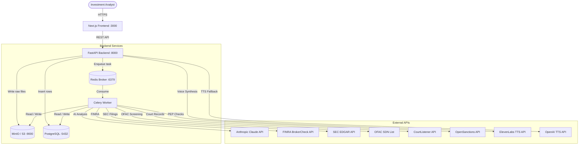
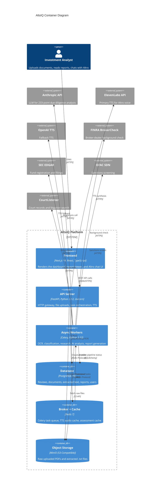
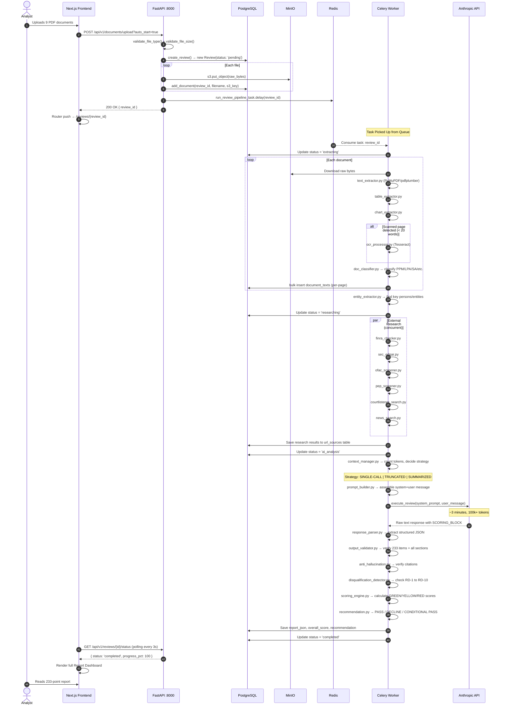
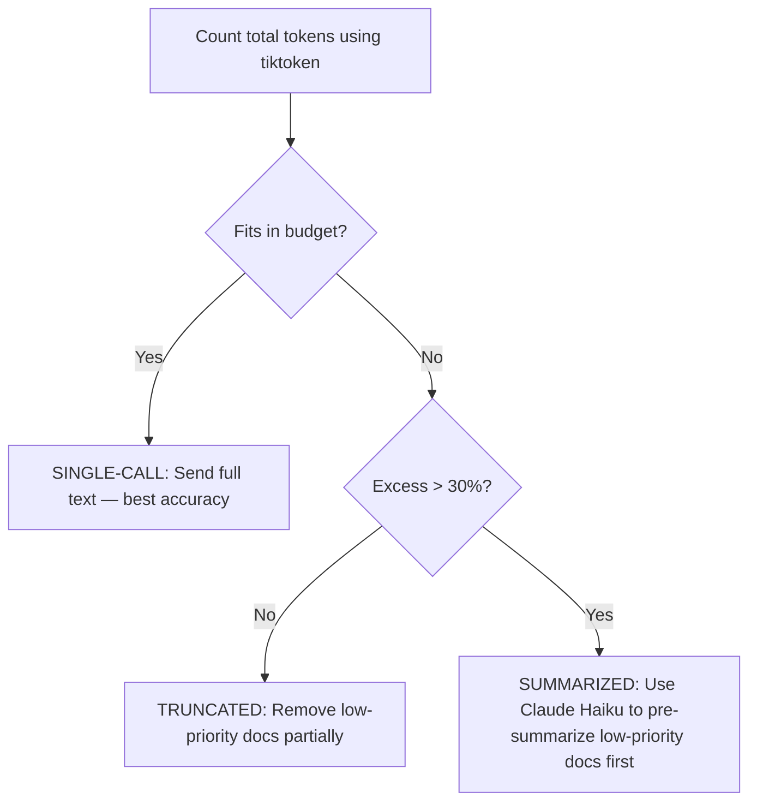
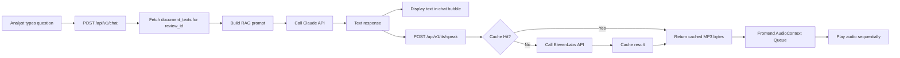
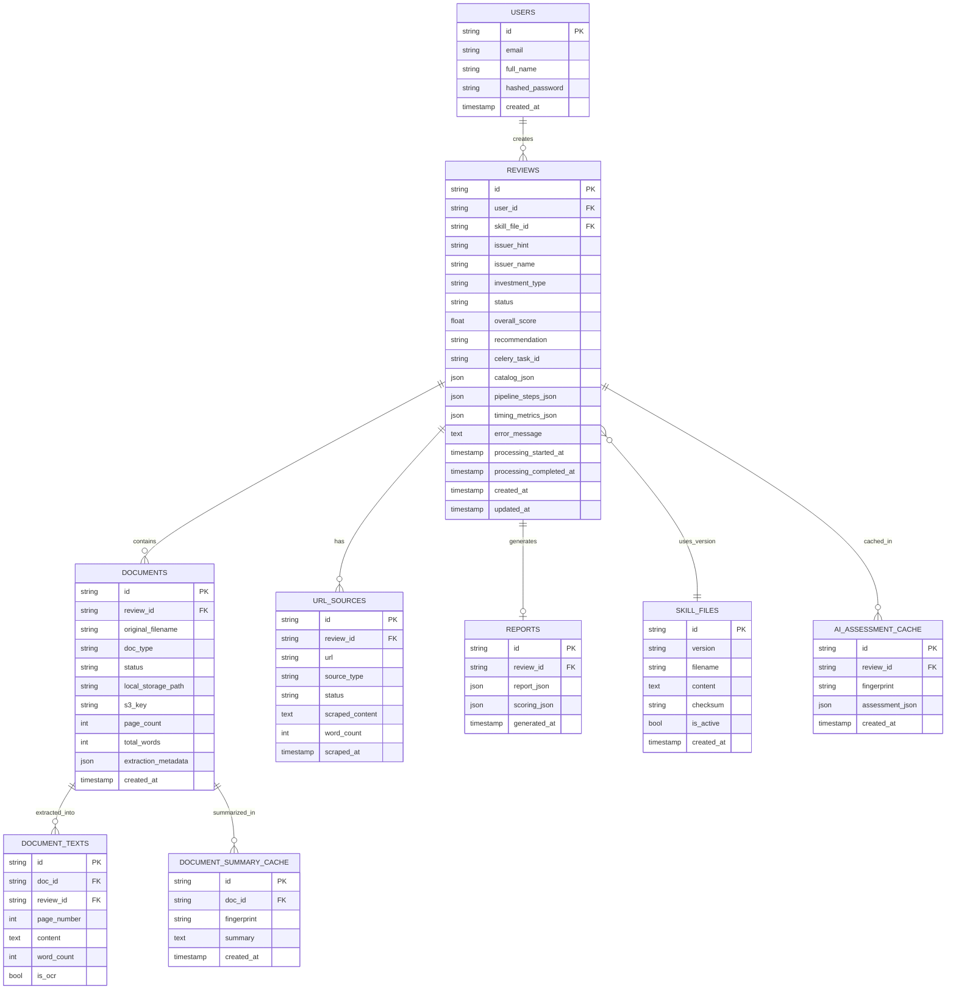

# AltsIQ — Complete Professional Developer Documentation

> **Version**: 1.0 | **Last Updated**: 2026-07-31 | **Status**: Production-Ready  
> **Maintained By**: Engineering Team  

---

## Table of Contents

1. [Project Introduction](#1-project-introduction)
2. [System Architecture](#2-system-architecture)
3. [Technology Stack](#3-technology-stack)
4. [Complete Project Structure](#4-complete-project-structure)
5. [Pipeline Execution Flow](#5-pipeline-execution-flow)
6. [AI Engine — The Intelligence Core](#6-ai-engine--the-intelligence-core)
   - 6.1 Skill File System
   - 6.2 Context Window Manager
   - 6.3 Prompt Builder
   - 6.4 Claude Client
   - 6.5 Response Parser
   - 6.6 Output Validator
   - 6.7 Anti-Hallucination Engine
   - 6.8 Disqualification Detector
7. [Scoring Engine & Report Generation](#7-scoring-engine--report-generation)
8. [Document Processing Services](#8-document-processing-services)
9. [External Research Services](#9-external-research-services)
10. [Altro — AI Voice Due Diligence Specialist](#10-altro--ai-voice-due-diligence-specialist)
11. [Backend APIs — Complete Reference](#11-backend-apis--complete-reference)
12. [Database Schema — All Models](#12-database-schema--all-models)
13. [Frontend Architecture](#13-frontend-architecture)
14. [Security](#14-security)
15. [Performance & Caching](#15-performance--caching)
16. [Deployment (Docker Compose)](#16-deployment-docker-compose)
17. [Configuration Reference (.env)](#17-configuration-reference-env)
18. [Debugging Guide](#18-debugging-guide)
19. [Developer Handbook](#19-developer-handbook)
20. [Appendix — Glossary & References](#20-appendix--glossary--references)

---

## 1. Project Introduction

### 1.1 What is AltsIQ?
**AltsIQ (Alternative Investment Intelligence)** is an enterprise-grade AI-powered due diligence platform built for the alternative investment industry. It automates the entire due diligence process — from ingesting raw legal documents to generating a standardized **233-point compliance report** — in minutes instead of weeks.

The platform also features **Altro**, an interactive, voice-enabled AI Due Diligence Specialist (a 3D avatar) that allows users to interrogate findings conversationally using natural language and voice.

### 1.2 Problem Statement
Traditional due diligence on alternative investments (Private Equity, Hedge Funds, Real Estate, VC) requires analysts to:
- Read 200–1,000 pages of dense legal and financial documents
- Manually search FINRA BrokerCheck, SEC EDGAR, OFAC SDN lists, court records
- Compile a compliance report across dozens of criteria
- This process takes **2–4 weeks per investment** and is highly error-prone due to analyst fatigue

### 1.3 Proposed Solution
AltsIQ provides a single, end-to-end automated pipeline that:
1. Ingests raw documents (PDF, DOCX, XLSX, images)
2. Performs ultra-fast text extraction + Smart OCR on scanned pages
3. Classifies each document by type (PPM, LPA, Subscription Agreement, etc.)
4. Automatically runs external research: FINRA BrokerCheck, SEC EDGAR, OFAC SDN, PEP screening, court records
5. Assembles a 100k+ token context and passes it to Anthropic Claude
6. Generates an instant, precise 233-point JSON due diligence report
7. Validates the output with an anti-hallucination checker
8. Makes the report available via a rich web dashboard and interactive voice AI (Altro)

### 1.4 Target Users
| Role | How They Use AltsIQ |
|------|---------------------|
| Investment Analysts | Upload documents, monitor extraction, read the 233-point report |
| CIOs / Partners | Review the overall score and recommendation |
| Compliance Officers | Verify FINRA/SEC/OFAC checks via the appendices |
| New Developers | This document! |

### 1.5 Key Features
1. **Smart OCR**: Skips text-native PDFs entirely; only OCRs scanned/image pages
2. **Document Classification**: Auto-identifies PPM, LPA, SA, DDQ, financials, etc.
3. **External Research**: FINRA, SEC EDGAR, OFAC, PEP Screening, CourtListener, news
4. **233-Point AI Analysis**: All 10 categories across 233 distinct criteria, scored GREEN/YELLOW/RED/GRAY
5. **10 Hard-Gate Disqualifiers (RD-1 to RD-10)**: Auto-DECLINE if any are triggered
6. **Anti-Hallucination Engine**: Verifies every cited page number and quoted text
7. **Report Export**: JSON, HTML, PDF, plain-text exports
8. **Altro Voice AI**: Interactive 3D avatar with ElevenLabs TTS (with OpenAI TTS fallback)

---

## 2. System Architecture

### 2.1 High-Level Architecture



### 2.2 C4 Container Diagram



### 2.3 Service Port Map

| Service | Container Name | Port | Description |
|---------|---------------|------|-------------|
| FastAPI Backend | `altsiq-api` | 8000 | Main REST API |
| Next.js Frontend | `altsiq-frontend` | 3000 | Web UI |
| PostgreSQL | `altsiq-db` | 5432 | Primary database |
| Redis | `altsiq-redis` | 6379 | Broker + cache |
| MinIO | `altsiq-minio` | 9000 (API), 9001 (Console) | Object storage |
| Celery Worker | `altsiq-celery-worker` | N/A | Background tasks |

---

## 3. Technology Stack

| Technology | Version | Role | Why Chosen |
|-----------|---------|------|-----------|
| **Python** | 3.12 | Backend language | LLM ecosystem, PDF libraries, async support |
| **FastAPI** | 0.115+ | REST API framework | Native async, auto Swagger docs, Pydantic types |
| **Celery** | 5.x | Async task queue | Handles 3-minute AI pipeline without HTTP timeout |
| **SQLAlchemy** | 2.x | ORM | Type-safe DB queries, prevents SQL injection |
| **Pydantic v2** | 2.x | Config & schemas | Runtime validation, settings management |
| **Next.js** | 14/15 | Frontend framework | App Router, SSR, TypeScript-first |
| **React** | 18 | UI library | Component model, hooks, React Query |
| **@tanstack/react-query** | 5.x | Server state | Auto-polling, caching, background refetch |
| **PostgreSQL** | 16 | Primary database | ACID, JSONB for 233-point reports, full-text search |
| **Redis** | 7 | Broker + cache | Fast ephemeral storage, Celery transport |
| **MinIO** | Latest | Object storage | S3-compatible local file store for raw PDFs |
| **Docker / Compose** | 27+ | Containerization | Reproducible dev + prod environments |
| **Anthropic Claude** | `claude-sonnet-4-6` | AI Engine | 200k context window, best for financial doc analysis |
| **ElevenLabs** | SDK v1 | Primary TTS | Ultra-realistic voice for Altro persona |
| **OpenAI TTS** | SDK v1 | Fallback TTS | `tts-1-hd`, voice `onyx` |
| **PyMuPDF / pdfplumber** | Latest | PDF extraction | Fast text and table extraction |
| **Tesseract** | 5.x | OCR Engine | Scanned page fallback OCR |
| **tiktoken** | Latest | Token counting | Claude context budget management |

---

## 4. Complete Project Structure

```text
AltsIQ/                               ← Repository root
├── .env                              ← All secrets and config (NEVER commit)
├── .env.example                      ← Template for .env
├── docker-compose.yml                ← Orchestrates all 6 services
│
├── backend/
│   ├── Dockerfile                    ← Backend container definition
│   ├── requirements.txt              ← Python dependencies
│   ├── alembic/                      ← Database migrations (Alembic)
│   └── app/
│       ├── main.py                   ← FastAPI app factory + startup lifecycle
│       ├── core/
│       │   └── config.py             ← Pydantic BaseSettings (reads .env)
│       ├── db/
│       │   └── session.py            ← SQLAlchemy engine + session factory
│       ├── models/                   ← SQLAlchemy ORM models (DB tables)
│       │   ├── base.py               ← Declarative base class
│       │   ├── user.py               ← User account table
│       │   ├── review.py             ← Central review entity
│       │   ├── document.py           ← Uploaded document metadata
│       │   ├── document_text.py      ← Per-page extracted text
│       │   ├── url_source.py         ← Scraped external URLs
│       │   ├── report.py             ← Final 233-point JSON report
│       │   ├── skill_file.py         ← AI prompt template versioning
│       │   ├── ai_assessment_cache.py← Cached AI assessment results
│       │   └── document_summary_cache.py ← Cached document summaries
│       ├── schemas/                  ← Pydantic schemas (API request/response)
│       │   ├── review.py             ← Review create/status/list schemas
│       │   ├── document.py           ← Upload response schemas
│       │   └── report.py             ← Report JSON response schema
│       ├── api/
│       │   ├── deps.py               ← Shared dependencies (auth extraction)
│       │   ├── review_rbac.py        ← RBAC enforcement helper
│       │   └── v1/
│       │       ├── router.py         ← Main APIRouter — mounts all sub-routers
│       │       ├── reviews.py        ← CRUD + pipeline orchestration
│       │       ├── documents.py      ← File upload endpoint
│       │       ├── reports.py        ← Report JSON/HTML/PDF/TXT exports
│       │       ├── tts.py            ← ElevenLabs + OpenAI TTS endpoints
│       │       ├── auth.py           ← Login / JWT issuance
│       │       ├── users.py          ← User management
│       │       ├── admin.py          ← Admin-only routes
│       │       ├── research.py       ← Research status endpoints
│       │       ├── inspect.py        ← Pipeline inspection/debug routes
│       │       └── workflow_aliases.py ← Workflow-aligned route aliases
│       ├── services/
│       │   ├── pipeline_runner.py    ← ★ MAIN Celery pipeline orchestrator
│       │   ├── review_store.py       ← DB CRUD for Review entities
│       │   ├── report_render.py      ← HTML/TXT/PDF report renderer
│       │   ├── user_account.py       ← User creation helper
│       │   ├── ai/                   ← AI intelligence services
│       │   │   ├── claude_client.py  ← Anthropic SDK wrapper (retry, cost tracking)
│       │   │   ├── skill_loader.py   ← Loads 233-point prompt template
│       │   │   ├── context_manager.py← Context window budget management
│       │   │   ├── prompt_builder.py ← Assembles final Claude prompt
│       │   │   ├── response_parser.py← Parses Claude raw text → structured JSON
│       │   │   ├── output_validator.py← Validates completeness of parsed report
│       │   │   ├── anti_hallucination.py ← Verifies cited page/quotes
│       │   │   ├── disqualification_detector.py ← Checks 10 hard-gate rules
│       │   │   ├── assessment_cache.py← Redis cache for AI assessment results
│       │   │   ├── fingerprint.py    ← Document fingerprinting for caching
│       │   │   ├── summary_cache.py  ← Haiku pre-pass summaries cache
│       │   │   └── prompt_version_tracker.py ← Tracks which skill version was used
│       │   ├── document/             ← Document processing services
│       │   │   ├── text_extractor.py ← PyMuPDF/pdfplumber text extraction
│       │   │   ├── ocr_processor.py  ← Tesseract OCR for scanned pages
│       │   │   ├── table_extractor.py← Structured table extraction
│       │   │   ├── chart_extractor.py← Chart/graph detection and extraction
│       │   │   ├── doc_classifier.py ← Document type classification (PPM, LPA, etc.)
│       │   │   ├── investment_type.py← Investment type detection
│       │   │   ├── office_extract.py ← DOCX/XLSX extraction
│       │   │   └── catalog.py        ← Assembles the full document catalog
│       │   ├── research/             ← External research integrations
│       │   │   ├── aggregator.py     ← Orchestrates all research checks
│       │   │   ├── entity_extractor.py ← Extracts key persons/entities from docs
│       │   │   ├── finra_checker.py  ← FINRA BrokerCheck API integration
│       │   │   ├── sec_edgar.py      ← SEC EDGAR filing lookup
│       │   │   ├── ofac_screener.py  ← OFAC SDN list sanctions screening
│       │   │   ├── pep_screener.py   ← Politically Exposed Person screening
│       │   │   ├── courtlistener_search.py ← Court record search
│       │   │   ├── iapd_lookup.py    ← Investment Adviser Public Disclosure
│       │   │   ├── news_search.py    ← News and media search
│       │   │   ├── sos_lookup.py     ← Secretary of State entity lookup
│       │   │   ├── extended_background.py ← Combined background check
│       │   │   ├── snapshot_cache.py ← Caches research results to avoid repeat calls
│       │   │   ├── wire_contact_capture.py ← Extracts wire transfer + contact info
│       │   │   └── log_flatten.py    ← Flattens research results for AI prompt
│       │   ├── scraper/              ← URL scraping services
│       │   │   ├── http_scraper.py   ← HTTP GET scraper (httpx)
│       │   │   ├── browser_scraper.py← JS-rendered page scraper (Playwright)
│       │   │   └── hybrid.py         ← Tries HTTP first, falls back to browser
│       │   └── report/               ← Report generation services
│       │       ├── scoring_engine.py ← Calculates GREEN/YELLOW/RED scores
│       │       ├── recommendation.py ← Generates final PASS/DECLINE recommendation
│       │       ├── json_builder.py   ← Builds the final structured JSON report
│       │       ├── html_renderer.py  ← Jinja2-based HTML report renderer
│       │       └── pdf_generator.py  ← Generates downloadable PDF
│       ├── tasks/                    ← Celery task entry points (thin wrappers)
│       │   ├── review_pipeline.py    ← Calls pipeline_runner.run_review_pipeline()
│       │   ├── document_processing.py← Document extraction tasks
│       │   └── research_tasks.py     ← External research tasks
│       └── utils/
│           ├── constants.py          ← ReviewStatus enum, document type constants
│           └── (other helpers)
│
├── frontend/
│   ├── package.json                  ← Node dependencies
│   ├── next.config.mjs               ← Next.js configuration
│   ├── tsconfig.json                 ← TypeScript configuration
│   └── src/
│       ├── app/                      ← Next.js App Router pages
│       │   ├── page.tsx              ← Landing page (public)
│       │   ├── layout.tsx            ← Root HTML layout
│       │   └── (dashboard)/          ← Authenticated route group
│       │       ├── layout.tsx        ← Dashboard shell (sidebar + header)
│       │       ├── dashboard/page.tsx ← Review list dashboard
│       │       ├── reviews/
│       │       │   ├── new/page.tsx  ← Document upload page
│       │       │   └── [id]/page.tsx ← Individual review report viewer
│       │       └── altrochat/page.tsx ← Altro voice AI chat interface
│       ├── components/               ← Reusable React components
│       │   ├── RiskScorecard.tsx     ← Per-category score display
│       │   ├── DocumentViewer.tsx    ← File listing + download links
│       │   ├── PipelineProgress.tsx  ← Animated progress bar for pipeline
│       │   └── (other components)
│       └── lib/
│           ├── altroSpeech.ts        ← Audio queue manager for TTS playback
│           └── api.ts                ← Typed API client wrappers
│
└── docs/                             ← Developer documentation (this folder)
```

---

## 5. Pipeline Execution Flow

This is the most important flow in the system. Understanding this end-to-end sequence is essential for any developer working on AltsIQ.

### 5.1 Complete Pipeline Sequence Diagram



### 5.2 Pipeline Step States

Each pipeline step transitions through these states, tracked in the `pipeline_steps_json` JSONB column:

| Step Key | Label | State Values |
|----------|-------|--------------|
| `uploading_extracting` | Uploading and extracting documents | `pending → in_progress → complete / failed` |
| `ocr` | Running OCR on scanned pages | `pending → in_progress → complete / skipped` |
| `url_scraping` | Scraping issuer URLs | `pending → in_progress → complete / skipped` |
| `external_research` | Fetching external research | `pending → in_progress → complete / failed` |
| `ai_analysis` | AI analysis — 233 checkpoints | `pending → in_progress → complete / failed` |
| `report_generation` | Generating report | `pending → in_progress → complete / failed` |

---

## 6. AI Engine — The Intelligence Core

The AI Engine is the most sophisticated part of AltsIQ. It is not just a single API call — it is a multi-stage pipeline with 8 specialized services working together to ensure financial-grade accuracy.

### 6.1 Skill File System (`skill_loader.py`)

**What**: The Skill File is a large Markdown document containing the 233-point due diligence checklist and all instructions for the AI. It is essentially Claude's "manual" for conducting due diligence.

**Why**: The skill file is versioned and stored in the database (`skill_files` table). Every review records which skill file version was used (`review.skill_file_id`), creating a full audit trail. If the prompt template changes, past reviews are not affected.

**How it works**:
1. `load_skill_file()` first checks a 5-minute in-memory TTL cache
2. If cache miss: queries `skill_files` DB table for the active version
3. If no DB record: falls back to reading from the filesystem path `/app/alt-inv-ops-review-skill.md`
4. Computes SHA256 checksum for integrity verification
5. Validates that all 10 categories and all 7 step headers are present

**The Skill File Structure (10 Categories × 233 Items)**:
| Category | Domain | Item Count |
|----------|---------|-----------|
| Category 1 | Fund Structure & Documentation | 24 |
| Category 2 | Management & Personnel | 25 |
| Category 3 | Investment Strategy & Process | 24 |
| Category 4 | Legal & Regulatory Compliance | 18 |
| Category 5 | Financials & Performance | 22 |
| Category 6 | Operations & Service Providers | 21 |
| Category 7 | Risk Management & Transparency | 20 |
| Category 8 | Investor Terms & Protections | 28 |
| Category 9 | ESG & Governance | 28 |
| Category 10 | Background & Reputation | 23 |
| **TOTAL** | | **233** |

### 6.2 Context Window Manager (`context_manager.py`)

**What**: Manages Claude's 200,000 token context window budget to ensure all documents fit.

**Why**: Alternative investment document sets can easily exceed 200k tokens (200-page PPM + 100-page LPA + audited financials). Without a budget manager, the API call fails.

**Three-Tier Strategy**:


**Document Priority Order** (highest = keep full text last):
`PPM (100) > SA (95) > FINANCIALS (90) > OPERATING_AGREEMENT (80) > COMPLIANCE (75) > FORMATION_DOCS (70) > LEGAL_OPINION (65) > INSURANCE (50) > DDQ (45) > other`

**Key Parameters**:
- `_MODEL_CONTEXT_LIMIT = 200,000` tokens
- `_OUTPUT_RESERVE = 32,000` tokens (reserved for Claude's response)
- `_SKILL_RESERVE_ESTIMATE = 12,000` tokens (reserved for skill file prompt)
- `_SUMMARIZE_THRESHOLD_RATIO = 0.30` (30% excess triggers summarization)

### 6.3 Prompt Builder (`prompt_builder.py`)

**What**: Assembles the final multi-part prompt sent to Claude.

**Structure**:
```
SYSTEM PROMPT:
  [Full 233-Point Skill File Content — the AI's "manual"]

USER MESSAGE:
  [Section 1: Document Inventory]
  --- PPM.pdf ---
  PAGE 1: [extracted text]
  PAGE 2: [extracted text]
  ...
  [Section 2: External Research Results]
  FINRA: John Doe — Clean record
  OFAC: Jane Smith — No match
  ...
  [Section 3: Output Requirements]
  CRITICAL INSTRUCTIONS:
  - Score all 233 items
  - Conservative scoring defaults
  - Check all 10 RD items
  - Output SCORING_BLOCK_START...SCORING_BLOCK_END
```

**Conservative Scoring Enforcement**: Claude is explicitly instructed:
- GREEN only when compliance evidence is **clear and unambiguous**
- YELLOW when in doubt between GREEN and YELLOW (default conservative)
- RED when evidence is ambiguous but concerning
- GRAY only when item is genuinely N/A

### 6.4 Claude Client (`claude_client.py`)

**What**: The Anthropic SDK wrapper with retry logic, cost tracking, and prompt caching.

**Key Features**:
- **Prompt Caching**: Enabled via `anthropic-beta: prompt-caching-2024-07-31` header. The massive skill file system prompt is cached, saving ~90% on repeated calls (system prompt goes from $3.00 to $0.30 per 1M tokens)
- **Retry Logic**: 4 attempts with exponential backoff: `1s → 2s → 4s → 8s`
- **Cost Tracking**: Logs `input_tokens`, `output_tokens`, and `cost_usd` per call
- **Streaming**: Uses `client.messages.stream()` to detect early `stop_reason=max_tokens`

**Configurable Parameters**:
| Env Var | Default | Description |
|---------|---------|-------------|
| `CLAUDE_MODEL` | `claude-sonnet-4-6` | Model ID (must match available models for your API key) |
| `CLAUDE_MAX_TOKENS` | `32000` | Maximum response tokens |
| `CLAUDE_TEMPERATURE` | `0.0` | Deterministic output (critical for financial compliance) |
| `CLAUDE_MAX_RETRIES` | `3` | Number of retry attempts |

### 6.5 Response Parser (`response_parser.py`)

**What**: Parses Claude's raw text output into a structured `ParsedReport` Python object.

**Why**: Claude returns a large narrative text response + a machine-parseable `SCORING_BLOCK`. The parser extracts both.

**The Scoring Block**:
```
===SCORING_BLOCK_START===
1.1|GREEN|PPM received and verified as final
1.2|YELLOW|PPM version ambiguity needs confirmation
...
10.23|GRAY|No applicable ESG disclosure item identified
===SCORING_BLOCK_END===
```
Each line is: `ITEM_ID|COLOR|ONE_LINE_REASON`

**Expected Item Counts per Category** (enforced at parse time):
```python
EXPECTED_CATEGORY_COUNTS = {1: 24, 2: 25, 3: 24, 4: 18, 5: 22, 6: 21, 7: 20, 8: 28, 9: 28, 10: 23}
TOTAL_EXPECTED_ITEMS = 233
```

### 6.6 Output Validator (`output_validator.py`)

**What**: Validates the parsed report for completeness before it is saved to the database.

**What it checks**:
1. All 10 required report sections present (header, executive_summary, detailed_findings, etc.)
2. Exactly 233 scored items (validates per-category counts)
3. All 5 appendices present (A=Document Inventory, B=Research Log, C=Operational Capture, D=Personnel, E=Regulatory Log)
4. Conservative scoring enforcement patterns
5. Edge cases: non-English documents, password-protected PDFs

**Validation Severities**:
- `error`: Critical issue, report may be unreliable
- `warning`: Non-critical but should be reviewed
- `info`: Informational notice

### 6.7 Anti-Hallucination Engine (`anti_hallucination.py`)

**What**: Cross-references every citation in Claude's report against the actual uploaded documents.

**Why this is critical**: LLMs can "hallucinate" (fabricate) evidence. In a financial due diligence context, a fabricated citation like "PPM page 47 states management fee is 1%" could cause an analyst to make a real investment decision based on something that was never actually in the document.

**What it checks**:
1. **Document citations**: Does the cited filename exist in the uploaded set?
2. **Page number citations**: Is the cited page number within the valid range for that document?
3. **Quote verification**: Can the quoted text be found (with fuzzy matching ≥ 65% similarity) in the actual extracted page text?

**Fuzzy matching**: Uses Python's `difflib.SequenceMatcher` with threshold `_QUOTE_MATCH_THRESHOLD = 0.65`.

### 6.8 Disqualification Detector (`disqualification_detector.py`)

**What**: Independently checks the 10 Hard-Gate Disqualifier items (RD-1 to RD-10).

**Why**: These are absolute dealbreakers. Even if an investment scores 95% on all 233 criteria, any single RD trigger results in automatic DECLINE regardless of overall score.

**The 10 Hard-Gate Items (RD-1 through RD-10)**:
| RD Code | Condition | Example |
|---------|-----------|---------|
| RD-1 | Unregistered broker-dealer | Distributor not registered with FINRA |
| RD-2 | Active OFAC/SDN sanction match | Key principal on OFAC SDN list |
| RD-3 | Criminal conviction (key personnel) | Fraud conviction in last 10 years |
| RD-4 | Active SEC/FINRA enforcement action | Ongoing investigation |
| RD-5 | Guaranteed returns promised | "12% guaranteed annual return" in PPM |
| RD-6 | Audit failure or no auditor | No independent CPA auditor |
| RD-7 | Unregistered securities offering | Fund not registered or exempt |
| RD-8 | Material misrepresentation in documents | Conflicting legal name |
| RD-9 | PCAOB non-compliant auditor | Auditor not registered with PCAOB |
| RD-10 | Ponzi-like structure indicators | Returns paid from new investor capital |

**Negation Logic**: The detector carefully handles negation to avoid false positives (e.g., "no OFAC match" should NOT trigger RD-2). It uses a 480-character negation window regex to detect clean/negative language around trigger keywords.

---

## 7. Scoring Engine & Report Generation

### 7.1 Scoring Formula (`scoring_engine.py`)

```
Category Score (%) = (Number of GREEN items / Total Applicable Items) × 100
Overall Score (%)  = (Total GREEN across all categories / Total Applicable items) × 100
```
> ⚪ GRAY (N/A) items are **excluded from the denominator**. An item that doesn't apply is not counted against the fund.

**Grade Thresholds**:
| Grade | Score | Recommendation |
|-------|-------|---------------|
| A | 90-100% | PASS — EXCELLENT |
| B | 80-89% | PASS — GOOD |
| C | 70-79% | PASS — ACCEPTABLE |
| D | 60-69% | CAUTION — NEEDS IMPROVEMENT |
| E | 50-59% | CAUTION — SIGNIFICANT CONCERNS |
| F | < 50% | FAIL |

### 7.2 Recommendation Engine (`recommendation.py`)
After scoring, the recommendation module determines the final verdict:
1. If any RD-1 to RD-10 is triggered → **DECLINE** (overrides all scores)
2. If overall score < 50% → **DECLINE**
3. If overall score 50-70% → **CONDITIONAL PASS** (with required remediation list)
4. If overall score > 70% → **PASS** (with advisory notes)

### 7.3 Report Export Formats (`reports.py`, `report_render.py`)
| Format | Route | Description |
|--------|-------|-------------|
| JSON | `GET /api/v1/reports/{id}` | Machine-readable structured JSON |
| HTML | `GET /api/v1/reports/{id}/html` | Browser-renderable Jinja2 HTML |
| Plain Text | `GET /api/v1/reports/{id}/txt` | UTF-8 text, downloadable |
| PDF | `GET /api/v1/reports/{id}/pdf` | Downloadable PDF (via WeasyPrint) |

---

## 8. Document Processing Services

### 8.1 Text Extraction (`text_extractor.py`)
- Uses `pdfplumber` and `PyMuPDF (fitz)` for text extraction
- Extracts text page-by-page with page number tags
- Returns list of `{page_number, raw_text, word_count}`

### 8.2 Smart OCR (`ocr_processor.py`)
**Decision Logic**:
```python
if word_count < MIN_WORDS_TEXT_PAGE (default 20) or OCR_ALL_PDF_PAGES == True:
    # Convert page to image, run Tesseract OCR
    text = pytesseract.image_to_string(page_image, config='--psm 6')
```
**Config**: `OCR_ALL_PDF_PAGES=false` is the production-recommended setting. Only scanned pages trigger OCR.

### 8.3 Table Extraction (`table_extractor.py`)
- Uses `pdfplumber`'s `.extract_tables()` to detect and parse embedded tables
- Critical for financial statements (balance sheets, returns tables)
- Tables stored in `catalog_json.extracted_tables`

### 8.4 Chart Detection (`chart_extractor.py`)
- Detects embedded charts/graphs in PDFs via image analysis
- Classifies by type: bar, line, pie, scatter
- Results stored in `catalog_json.chart_summary`

### 8.5 Document Classifier (`doc_classifier.py`)
Automatically identifies the document type based on content patterns:
| Document Type | Examples |
|---------------|---------|
| `PPM` | Private Placement Memorandum |
| `SA` | Subscription Agreement |
| `LPA` | Limited Partnership Agreement |
| `DDQ` | Due Diligence Questionnaire |
| `FINANCIALS` | Audited financial statements |
| `OPERATING_AGREEMENT` | LLC/Fund operating agreement |
| `COMPLIANCE` | Compliance manual, Form ADV |
| `FORMATION_DOCS` | Certificate of formation |
| `LEGAL_OPINION` | Legal opinion letters |
| `OTHER` | Anything else |

### 8.6 Document Catalog (`catalog.py`)
The catalog is the final assembled data structure stored in `review.catalog_json`:
```json
{
  "documents": [...],
  "extracted_tables": {...},
  "chart_summary": {...},
  "external_research": {...}
}
```
This catalog is passed to the `context_manager.py` to build the Claude prompt.

---

## 9. External Research Services

### 9.1 Entity Extraction (`entity_extractor.py`)
Before any research can run, AltsIQ must identify **who** to research. The entity extractor parses all document text to identify:
- Fund Manager / GP name
- Key Principals (names, titles, CRD numbers)
- Broker-dealers
- Service providers (auditor, legal counsel, custodian)

### 9.2 Research Aggregator (`aggregator.py`)
Orchestrates all 8 research checks in parallel. Results are saved to the `url_sources` table and flattened into the AI prompt via `log_flatten.py`.

### 9.3 All Research Integrations

| Service | File | What It Checks | API |
|---------|------|---------------|-----|
| FINRA BrokerCheck | `finra_checker.py` | Broker-dealer registration, disciplinary history | `api.brokercheck.finra.org` |
| SEC EDGAR | `sec_edgar.py` | Fund registration (Form ADV, Form D), SEC actions | `efts.sec.gov`, `data.sec.gov` |
| OFAC SDN | `ofac_screener.py` | Sanctions list screening (fuzzy match at 0.85 threshold) | Treasury.gov |
| PEP Screening | `pep_screener.py` | Politically Exposed Persons | OpenSanctions API |
| CourtListener | `courtlistener_search.py` | Federal court records, litigation history | `courtlistener.com/api/rest/v4` |
| IAPD | `iapd_lookup.py` | Investment Adviser Public Disclosure | SEC IAPD |
| Secretary of State | `sos_lookup.py` | Business entity registration verification | State-level APIs |
| News Search | `news_search.py` | Media mentions, negative press | News APIs |

### 9.4 Research Snapshot Cache (`snapshot_cache.py`)
Research results are cached in the `external_research_snapshots` table keyed by entity name + date. This prevents redundant API calls if the same fund manager is reviewed twice in the same week.

---

## 10. Altro — AI Voice Due Diligence Specialist

### 10.1 What is Altro?
Altro is the interactive, voice-enabled AI assistant built into AltsIQ. It presents as a professional 3D-styled avatar in the UI and allows analysts to interrogate due diligence findings through natural conversation with voice responses.

### 10.2 Architecture



### 10.3 TTS Implementation (`tts.py`)

**Dual Provider Architecture**:
- **Primary**: ElevenLabs (`eleven_multilingual_v2` model, default voice `pNInz6obpgDQGcFmaJgB`)
- **Fallback**: OpenAI TTS (`tts-1-hd` model, voice `onyx`)
- Controlled by `TTS_PROVIDER=elevenlabs` env var

**ElevenLabs Voice Settings** (optimized for Altro's professional persona):
```python
VoiceSettings(
    stability=0.71,       # Voice consistency
    similarity_boost=0.85, # Match to trained voice
    style=0.15,           # Slight expressiveness
    use_speaker_boost=True # Audio clarity enhancement
)
```

**In-Memory LRU Cache**:
- Cache key: `SHA256(text + voice_id + speed)`
- Cache size: `TTS_CACHE_SIZE=512` entries
- Eviction: FIFO (oldest entry removed when full)
- HTTP header: `X-TTS-Cached: true/false`

**Max text length**: `4096` characters per request.

### 10.4 Audio Queue Manager (`altroSpeech.ts`)

**The Problem**: If a user sends 3 rapid messages, 3 audio responses could play simultaneously, creating chaos.

**The Solution**: A JavaScript `AudioContext` queue:
```typescript
// Simplified logic
const audioQueue: AudioBuffer[] = [];
let isPlaying = false;

function enqueue(mp3Blob: Blob) {
    // Decode MP3, push to queue
    audioQueue.push(decoded);
    if (!isPlaying) playNext();
}

function playNext() {
    if (audioQueue.length === 0) { isPlaying = false; return; }
    isPlaying = true;
    const source = audioContext.createBufferSource();
    source.buffer = audioQueue.shift();
    source.onended = playNext; // Chain to next audio automatically
    source.connect(audioContext.destination);
    source.start();
}
```

### 10.5 Debugging Altro

| Symptom | Root Cause | Fix |
|---------|------------|-----|
| Chat returns text but no voice | Missing `ELEVENLABS_API_KEY` in `.env` | Add key, restart API container |
| Voice stutters or is cut off | Browser autoplay policy blocking uninitiated audio | Ensure user clicked a page element before first TTS call |
| Altro answers with outside knowledge | System prompt not restrictive enough | Enforce "ONLY use the provided document context" in chat system prompt |
| `503 Service Unavailable` on `/tts/speak` | ElevenLabs key missing or invalid | Check key validity at [elevenlabs.io](https://elevenlabs.io) |
| Audio from previous message still playing | AudioContext queue not initialized | Verify `altroSpeech.ts` `audioContext.resume()` is called after user gesture |

---

## 11. Backend APIs — Complete Reference

The full OpenAPI spec is available at `http://localhost:8000/docs`.

### 11.1 Health Check
```
GET /health
Response: { "status": "ok", "service": "AltsIQ API" }
```

### 11.2 Documents API
```
POST /api/v1/documents/upload
  Query: auto_start=true|false
  Body: multipart/form-data { files: File[], review_id?: string }
  Response: { review_id, documents: [{ doc_id, filename, size_bytes }] }
  Errors: 400 (bad file type / too large)
```

### 11.3 Reviews API
```
POST /api/v1/reviews
  Body: { issuer_hint?, investment_type? }
  Response: ReviewResponse { id, status, created_at }

GET  /api/v1/reviews
  Response: ReviewListResponse { items[], total, page }

GET  /api/v1/reviews/{review_id}
  Response: ReviewResponse

GET  /api/v1/reviews/{review_id}/status
  Response: { review_id, status, pipeline_steps[], progress_pct, gate_action_required? }

POST /api/v1/reviews/{review_id}/start
  Starts the Celery pipeline
  Response: { status, celery_task_id }

DELETE /api/v1/reviews/{review_id}
  Hard deletes the review and all associated data
```

### 11.4 Reports API
```
GET /api/v1/reports/{review_id}
  Response: { review_id, data: { ...233-point JSON report } }

GET /api/v1/reports/{review_id}/html
  Response: text/html — Full rendered HTML report

GET /api/v1/reports/{review_id}/txt
  Response: text/plain; attachment — Downloadable .txt report

GET /api/v1/reports/{review_id}/pdf
  Response: application/pdf — Downloadable PDF
```

### 11.5 TTS API
```
POST /api/v1/tts/speak
  Body: { text: string (max 4096 chars), voice?: string, speed?: float }
  Response: audio/mpeg (MP3 bytes)
  Headers: X-TTS-Provider, X-TTS-Cached
  Errors: 503 (no API key), 500 (generation failed)
```

### 11.6 Auth API
```
POST /api/v1/auth/login
  Body: { email, password }
  Response: { access_token, token_type: "bearer", expires_in }
```

---

## 12. Database Schema — All Models

### 12.1 Entity-Relationship Diagram



### 12.2 Key Design Decisions

**Why JSONB for `report_json`?**
The 233-point report is deeply nested and can evolve structurally between skill file versions. Storing it as a single JSONB column allows the backend to save and retrieve the full report without schema migrations every time the skill file is updated.

**Why UUIDs for all Primary Keys?**
UUIDs prevent Insecure Direct Object Reference (IDOR) attacks. If sequential integers were used (id=1, 2, 3...), an attacker could enumerate all reviews by incrementing the ID in the URL.

**Why `ON DELETE CASCADE`?**
Deleting a `Review` automatically deletes all its `Documents`, `DocumentTexts`, `URLSources`, and `Reports`. This enforces strict data retention — when a user deletes a review, no orphaned data remains.

---

## 13. Frontend Architecture

### 13.1 Routing Structure (Next.js App Router)
```
/                          → Landing page (public)
/(dashboard)/              → Authenticated route group (shares layout.tsx)
  dashboard/               → Review list (historical reviews)
  reviews/new/             → Document upload interface
  reviews/[id]/            → Individual report viewer
  altrochat/               → Altro voice AI chat
```

### 13.2 State Management with React Query
The pipeline runs for ~3 minutes. The frontend uses `@tanstack/react-query` with `refetchInterval` to poll the status endpoint:

```typescript
const { data, isLoading } = useQuery({
    queryKey: ['review-status', reviewId],
    queryFn: () => fetchReviewStatus(reviewId),
    refetchInterval: (data) => 
        data?.status === 'completed' ? false : 3000, // Poll every 3s, stop when done
})
```

### 13.3 Component Architecture
| Component | Purpose |
|-----------|---------|
| `PipelineProgress.tsx` | Animated step-by-step progress display |
| `RiskScorecard.tsx` | Per-category score display (A-F grades) |
| `DocumentViewer.tsx` | File listing with download links |
| `altrochat/page.tsx` | Full-screen Altro voice interface |
| `altroSpeech.ts` | Audio queue manager |

---

## 14. Security

### 14.1 Authentication (JWT)
- Optional JWT authentication (`REQUIRE_API_AUTH=false` by default for local dev)
- RS256 signed JWTs, expiry configurable via `JWT_EXPIRATION_MINUTES=60`
- Decode logic in `api/deps.py` → `actor_user_id_from_request()`

### 14.2 RBAC (Role-Based Access Control)
Enforced in every route that accesses a specific review:
```python
enforce_review_access(rec, actor_user_id_from_request(request))
# → Raises HTTP 403 if review.user_id != current user
```

### 14.3 OWASP Top 10 Mitigations
| Threat | Mitigation |
|--------|-----------|
| SQL Injection | SQLAlchemy ORM with parameterized queries (no raw SQL) |
| XSS | React escapes all strings by default |
| IDOR | UUIDs for all IDs, RBAC on every review access |
| Sensitive Data Exposure | Secrets only in `.env`, never committed |
| File Upload Attacks | Strict MIME-type + extension + size validation |

### 14.4 Secrets Management
All API keys are stored exclusively in `.env` and loaded by Pydantic `BaseSettings`. Never hardcoded. Production should use a secrets manager (AWS Secrets Manager, HashiCorp Vault).

---

## 15. Performance & Caching

### 15.1 Smart OCR (Most Critical Optimization)
```
Setting: OCR_ALL_PDF_PAGES=false
Effect:  Only OCR pages with < 20 words
Impact:  200-page digital PDF: 5 min → 2 sec extraction
```

### 15.2 Claude Prompt Caching
- Header: `anthropic-beta: prompt-caching-2024-07-31`
- System prompt (12k tokens) cached for 5 minutes
- Cost reduction: 90% on cached tokens ($3.00 → $0.30 per 1M tokens)

### 15.3 TTS Audio Cache
- In-memory LRU cache (512 entries)
- Key: `SHA256(text + voice + speed)`
- Repeated phrases (e.g., Altro's greeting) served from cache with zero API cost

### 15.4 Research Snapshot Cache
- Research results (FINRA, OFAC, etc.) cached in the `external_research_snapshots` table
- Keyed by entity name + date
- Prevents redundant regulatory API calls for the same fund in the same period

### 15.5 Assessment Cache
- Full AI assessment results cached by document fingerprint
- If the same document set is submitted twice, skips the Claude API call entirely

---

## 16. Deployment (Docker Compose)

### 16.1 Starting the Full Stack
```bash
# 1. Copy environment variables
cp .env.example .env
# Then edit .env and add your API keys

# 2. Start all services
docker compose up -d --build

# 3. Verify all containers are running
docker compose ps

# 4. Access the services
# Frontend: http://localhost:3000
# Backend API: http://localhost:8000
# API Docs: http://localhost:8000/docs
# MinIO Console: http://localhost:9001
```

### 16.2 Service Startup Order
Docker Compose uses `depends_on` with health checks:
`db + redis + minio` → (healthy) → `minio-init` → `api` → `celery-worker`

### 16.3 Useful Docker Commands
```bash
# View API logs
docker compose logs api --tail=50 -f

# View Celery worker logs (most important for pipeline debugging)
docker compose logs celery-worker --tail=100 -f

# Restart API after .env change
docker compose restart api celery-worker

# Rebuild from scratch (clears all data)
docker compose down -v --remove-orphans
docker compose up -d --build
```

---

## 17. Configuration Reference (.env)

All environment variables with their purpose:

```bash
# --- Database ---
DATABASE_URL=postgresql+psycopg2://altsiq:altsiq123@db:5432/altsiq

# --- AI Engine ---
ANTHROPIC_API_KEY=sk-ant-xxx          # REQUIRED for 233-point analysis
CLAUDE_MODEL=claude-sonnet-4-6         # Must match your API tier's available models
CLAUDE_MAX_TOKENS=32000                # Response budget
CLAUDE_TEMPERATURE=0                   # MUST be 0 for deterministic compliance output
CLAUDE_MAX_RETRIES=3                   # Retry attempts on failure

# --- Voice / TTS ---
TTS_PROVIDER=elevenlabs                # "elevenlabs" (default) or "openai"
ELEVENLABS_API_KEY=                    # REQUIRED for Altro voice
ELEVENLABS_VOICE_ID=pNInz6obpgDQGcFmaJgB  # Adam voice (Altro persona)
ELEVENLABS_MODEL_ID=eleven_multilingual_v2
OPENAI_API_KEY=                        # Optional TTS fallback

# --- Storage ---
AWS_S3_BUCKET=altsiq-documents
AWS_ACCESS_KEY_ID=minio_access_key
AWS_SECRET_ACCESS_KEY=minio_secret_key
AWS_S3_ENDPOINT=http://minio:9000

# --- OCR (CRITICAL for performance) ---
OCR_ALL_PDF_PAGES=false                # MUST be false in production
MAX_OCR_PAGES_PER_DOCUMENT=30

# --- External Research ---
SEC_EDGAR_USER_AGENT=AltsIQ/1.0 (your@email.com)
FINRA_API_BASE_URL=https://api.brokercheck.finra.org
OFAC_FUZZY_THRESHOLD=0.85
COURTLISTENER_API_TOKEN=               # Optional — enables court record search

# --- Auth ---
REQUIRE_API_AUTH=false                 # Set true in production
JWT_SECRET_KEY=change-me-in-production
JWT_EXPIRATION_MINUTES=60

# --- Performance ---
MAX_FILE_SIZE_MB=50
TTS_CACHE_SIZE=512
```

---

## 18. Debugging Guide

### 18.1 Common Issues

| Issue | Symptom | Root Cause | Fix |
|-------|---------|------------|-----|
| AI Analysis 404 | `model: claude-3-5-sonnet-20241022 not found` | Wrong model name for your API tier | Check `docker compose exec api python -c "import anthropic; c=anthropic.Anthropic(); print([m.id for m in c.models.list().data])"` and update `CLAUDE_MODEL` |
| Extraction hangs | Pipeline stuck at "extracting" | Celery worker OOM crash | Check `docker compose logs celery-worker`. Increase Docker memory limit |
| TTS returns 503 | No voice from Altro | Missing `ELEVENLABS_API_KEY` | Add key to `.env`, restart API |
| No tables in DB | "relation does not exist" | Schema not initialized | `docker compose restart api` (auto-runs `Base.metadata.create_all`) |
| Report truncated | `stop_reason=max_tokens` warning | `CLAUDE_MAX_TOKENS` too low | Increase to `32000` or `65536` |

### 18.2 Checking Pipeline Status Directly
```bash
docker compose exec api python -c "
from app.services.review_store import list_reviews
for r in list_reviews():
    print(r.id[:8], r.status, r.overall_score)
"
```

### 18.3 Checking Available Claude Models (for your API key)
```bash
docker compose exec api python -c "
import os, anthropic
c = anthropic.Anthropic(api_key=os.getenv('ANTHROPIC_API_KEY'))
print([m.id for m in c.models.list().data])
"
```

---

## 19. Developer Handbook

### 19.1 How to Add a New API Route
1. Create `backend/app/api/v1/new_feature.py`
2. Define `router = APIRouter(prefix="/new_feature", tags=["new_feature"])`
3. Add to `backend/app/api/v1/router.py`:
   ```python
   from app.api.v1 import new_feature
   api_router.include_router(new_feature.router)
   ```

### 19.2 How to Add a New Database Table
1. Create `backend/app/models/new_table.py` extending `Base`
2. Import it in `backend/app/models/__init__.py`
3. Restart the API container (auto-creates table via `create_all`)
4. For production: generate an Alembic migration: `alembic revision --autogenerate -m "add new_table"`

### 19.3 Coding Standards
- **Python**: Black + Ruff formatting. Strict type hints on all functions
- **TypeScript**: ESLint + Prettier. No `any` types
- **No raw SQL**: Always use SQLAlchemy ORM
- **No secrets in code**: Always read from `get_settings()`

### 19.4 Knowledge Transfer (KT) — Critical Points
If you are new to this codebase, the following are the **most important non-obvious things to know**:

1. **`OCR_ALL_PDF_PAGES` must be `false`** — If you set it to `true`, document extraction will take 5+ minutes for every document. Every time this was accidentally enabled, the pipeline appeared "broken" due to timeouts.

2. **The Claude model name must exactly match your API tier** — The model ID `claude-3-5-sonnet-20241022` does not exist for newer API accounts. Always verify with `c.models.list()` before changing it.

3. **The 233 item count is sacred** — The entire output validation, scoring engine, and frontend rendering assumes exactly 233 items in the SCORING_BLOCK. If you change the skill file, you MUST update `EXPECTED_CATEGORY_COUNTS` in `response_parser.py` accordingly.

4. **Anti-hallucination is post-AI, not pre-AI** — The anti-hallucination engine runs *after* Claude responds, not as a pre-filter. It flags suspicious citations but does not block report generation — it creates warnings in the validation output.

5. **RBAC is enforced, but optional auth is off by default** — In local dev, `REQUIRE_API_AUTH=false`. In production, you MUST set it to `true` and configure the JWT secret.

---

## 20. Appendix — Glossary & References

### Glossary
| Term | Definition |
|------|-----------|
| **DD** | Due Diligence — the process of investigating an investment before committing capital |
| **PPM** | Private Placement Memorandum — the primary offering document for alternative investments |
| **LPA** | Limited Partnership Agreement — legal document governing the fund's structure |
| **SA** | Subscription Agreement — the investor's application to invest |
| **DDQ** | Due Diligence Questionnaire — standardized questionnaire submitted by the fund |
| **FINRA** | Financial Industry Regulatory Authority — broker-dealer regulator |
| **OFAC** | Office of Foreign Assets Control — administers sanctions lists |
| **SDN** | Specially Designated Nationals — OFAC's list of sanctioned individuals/entities |
| **PEP** | Politically Exposed Person — person holding or having held public office |
| **EDGAR** | SEC's Electronic Data Gathering, Analysis, and Retrieval system |
| **IAPD** | Investment Adviser Public Disclosure — SEC database for registered advisers |
| **RAG** | Retrieval-Augmented Generation — technique of grounding AI responses in source documents |
| **TTS** | Text-to-Speech — converting written text to spoken audio |
| **RBAC** | Role-Based Access Control — access permissions based on user roles |
| **IDOR** | Insecure Direct Object Reference — security vulnerability via predictable IDs |
| **ORM** | Object-Relational Mapper — translates Python classes to DB tables (SQLAlchemy) |
| **JSONB** | PostgreSQL's binary JSON storage format — supports indexing and querying |
| **LRU** | Least Recently Used — cache eviction policy |
| **OCR** | Optical Character Recognition — converts scanned images to text |

### Useful Links
| Resource | URL |
|----------|-----|
| FastAPI Documentation | https://fastapi.tiangolo.com/ |
| Next.js App Router | https://nextjs.org/docs/app |
| Anthropic API Reference | https://docs.anthropic.com/claude/reference/ |
| ElevenLabs API | https://docs.elevenlabs.io/api-reference |
| SQLAlchemy 2.0 Docs | https://docs.sqlalchemy.org/en/20/ |
| FINRA BrokerCheck API | https://api.brokercheck.finra.org/ |
| SEC EDGAR Full-Text Search | https://efts.sec.gov/LATEST/search-index?q= |
| OpenAPI Spec (local) | http://localhost:8000/docs |
| MinIO Console (local) | http://localhost:9001 |
